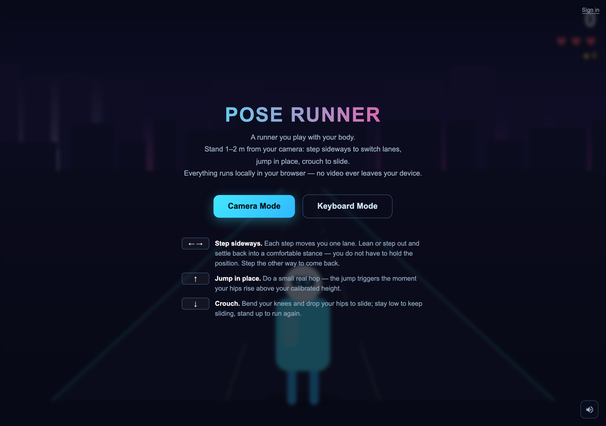

# Pose Runner

<p align="center">
  
</p>

**[▶ Play it in your browser](https://chuyuyan.github.io/webcam-pose-runner/)** — desktop and a webcam recommended; there is a keyboard fallback if you would rather not turn the camera on.

A 3-lane endless runner you play with your body: step sideways to switch lanes, jump in place, crouch to slide. Pose detection (MediaPipe Pose) runs 100% locally in the browser — **camera frames never leave your device**, and by default the game makes no requests to any server of mine at all.

Accounts are optional and **off by default** (see [Accounts](#accounts-optional)). Even when turned on, the only thing sent is your score — never camera data.

## Why this exists

Body-controlled games usually need a depth camera or a console peripheral. A
laptop webcam gives you 2D landmarks, noisy ones, at whatever framerate the
machine feels like — and the interesting question is whether that is enough to
control something that has to feel *immediate*.

Most of the work here is not the game. It is turning a jittery skeleton into
three reliable verbs:

- **A jump is not "the hips went up."** It is the hips rising above a height the
  player calibrated while standing still, which means the baseline has to adapt
  to someone who drifts closer to the camera without adapting to someone who is
  mid-hop.
- **A lane change must be forgiving.** People lean and settle back rather than
  holding a pose, so a step is an event, not a state you maintain.
- **A crouch must survive the model losing your legs**, because it usually does
  the moment you fold up.

Getting those three wrong makes the game feel broken in a way no amount of art
fixes, so the thresholds were tuned by replaying scripted landmark sequences
rather than by flailing at a camera — see [Debugging](#debugging).

The second constraint was privacy: a game that watches you through your webcam
should be provably not uploading it. Everything runs in the browser, and with
accounts off the page makes no requests to any server of mine at all.

## Tech stack

| Layer | Tools |
| --- | --- |
| Pose | MediaPipe Pose (Tasks Vision), running in-browser via WASM |
| Rendering | Canvas 2D, hand-rolled game loop — no engine, no framework |
| Code | One static `index.html` plus plain ES modules; no build step |
| Accounts | [playkit](https://github.com/Chuyuyan/playkit) SDK, optional and off by default |
| Hosting | GitHub Pages (static) |

## Run

Single static HTML file; any static host works (the MediaPipe model loads from a CDN, so an internet connection is required):

```sh
python3 serve.py 5175
# open http://localhost:5175
```

Use `serve.py` rather than `python3 -m http.server` while developing: the stdlib server only sends `Last-Modified`, so browsers cache `index.html` heuristically and keep serving a stale build after an edit. `serve.py` is the same server with `Cache-Control: no-store`.

Note: `getUserMedia` requires HTTPS or localhost, so deploy behind HTTPS.

## How to play

| Obstacle | Move |
|---|---|
| Red/white hurdle | Jump over |
| Yellow gate | Crouch and slide under |
| Train | Switch lanes around it |

Coins are worth **10 points**, and a coin taken within 22 units of the last one continues a **streak** worth 20% more each time, up to triple. One missed coin or one hit resets it. Flat points made a coin cost more distance than it returned, so the sane play was to ignore every arc and run the middle lane; the streak is what makes an overhead arc worth jumping *through* rather than around. The gap is measured in distance rather than seconds because the run keeps accelerating, and a time window would quietly widen into "any two coins in the same postcode" by the end of a long one. The winged boot is deliberately not on the way. It sits in the lane furthest from the line the coins are drawing, at a height of 3.0 — collection reaches 1.75 above you and a normal jump peaks at 1.50, so a standing player cannot touch it and a jumper has about a quarter of a second of window. Taking it costs you the trail and your coin streak, which is the trade; sitting on the route it was just another coin. Its lane has to be clear from two units before it to eight after, because a one-unit check happily put it three units in front of a train's nose — you jump, take it, and land into the face of the thing, which is a trap rather than a reward. It grants 7 seconds of **high jump**, which peaks at 3.3 units — above the 2.7 roof of a train, so while it lasts you can **land on top of a train and ride it** until it runs out from under you. Its cooldown is measured in seconds rather than distance: a distance gate keeps shrinking in real terms as the run speeds up, which is why the pickup kept creeping back to feeling constant however far the gate was pushed out.

**The coin trail is the route.** Coins used to be laid down whichever lane happened to be free at the moment they were generated, so a trail could point straight at the face of a train that arrived a second later — following the money was actively worse than ignoring it. The trail is now solved for: three lanes over a dozen slots is small enough to search exactly, so a short dynamic program walks the cost of each lane forward through the obstacles ahead and reads the cheapest runnable line back off the end. Coins are then drawn along it — lifted to hop height over a hurdle, dropped under the bar of a gate, and stepping one lane at a time, never two, because at 0.12 s a slot two lanes is not a step.

An action is priced well below a lane change (0.35 against 1.3). A hurdle costs you a jump and nothing else; a lane change costs you the width of the road at the moment you can least react to what is in the new lane. Priced at parity the cheapest route was almost always the next lane over, and a trail that only ever teaches *dodge* is not much of a teacher.

Coins are generated closer in than obstacles are, so by the time a stretch gets its trail the obstacles in it already exist. Sharing a frontier with the obstacle spawner meant the planner was routing around a road that was still being built. Trails are also spaced from the end of the last one rather than by a fixed step, since a step shorter than a trail let two of them overlap and interleave — two lines on the road at once, which defeats the point.

Measured over ~29,000 units against a bot that follows nothing but the coins and never looks at an obstacle: **5.7 hits per 1000 units against 11.7** for a bot that just holds the middle lane, and four times the coins. Auditing 6,146 coins found none inside a train, none unreachable inside a hurdle or a gate, and no two-lane jumps in a trail.

Coins are kept out of solid obstacles from both directions. A lane is only used if nothing solid already overlaps that stretch, and because a coin run is up to twelve units long and a train generated afterwards can still land on top of one, buried pickups are swept out again every time new obstacles appear.

The camera rises with you. It follows about half your height and lags behind, so a jump still reads as *you* going up rather than the world dropping away. Raising the camera pushes ground features down the screen by an amount that scales with their projection — the road under your feet swings out and down, distant buildings barely move, and the horizon holds still. That parallax is what sells the lift; translating the whole image would just look like a pan.

The player has real vertical physics (gravity, velocity, and whatever surface is underfoot) rather than a fixed jump arc, which is what gives a train roof something to interrupt. A roof only holds you up if you came down onto it from above — without that check, sidestepping into the lane of a train already alongside you teleported you onto its roof instead of hitting its flank, which quietly made the game close to unloseable.

Keyboard mode: ← → switch lanes, ↑ jump, ↓ slide. In camera mode press C to recalibrate.

On a phone or tablet the second mode becomes **touch**: swipe left/right to switch lanes, swipe up or tap anywhere to jump, swipe down to slide, and use the on-screen pause button. The choice is made from input capability (`pointer: coarse` plus a non-zero `maxTouchPoints`), not from the user agent string — what matters is whether there is a finger on the glass. A laptop with a touchscreen reports both and keeps its keyboard; the swipe handler only ever adds a way in.

Swipes resolve on `pointermove`, the moment the stroke passes 26 px, rather than on release. Waiting for the finger to lift adds the whole length of the stroke to input latency, which at speed is the difference between clearing a hurdle and hitting it. Pull-to-refresh and double-tap zoom are disabled over the canvas, because on a phone those browser gestures fire on exactly the strokes the game reads as jump and slide — but the menu panel keeps vertical panning, so a guide taller than the screen can still be scrolled.

## Themes

Each run picks the next of three — **Neon City**, **Summer Shore**, **Midwinter** — cycling rather than choosing at random, because random repeats and the whole point is that consecutive runs look different. A theme is one entry in the `THEMES` table: sky, skyline, ground, road, kerbs, lane markings, foliage and building palettes, plus a canopy shape, a roof shape, a weather effect and which form the big obstacle takes. Adding a fourth is a table entry, not a pass through the renderer.

Summer Shore is open water: no buildings anywhere, the far layer is rounded islands rather than a skyline, and the verges carry palms, buoys bobbing in their own ripples, and rocks. The train there is a **shark** — same footprint and the same lethal height, so nothing about the collision rules or riding on top changes, only what is coming at you. Midwinter has falling snow, snow-loaded conifers and snow on every roof.

The shark reuses the trains' box geometry rather than a tapered body of its own. Two attempts at a rounded one read as a stack of discs close up and a grey slab far away, and the box is already proven to close cleanly from every angle — so the identity lives entirely in the face on the front: snout, a mouth of teeth across the middle, and eyes. The first version put the jaw down at the waterline, which is exactly where the player stands, hiding the one feature that identifies it.

## Fitting the screen

The camera's height above the road is not a free parameter: it is the gap between the horizon and your feet, measured in world units. Pinning the horizon to a fraction of the window height while scaling world units by the window width lets that ratio drift with the window shape — the same code put the camera 2.6 units up on a 16:9 laptop and **10.2 units up on a phone held upright**, which is why the game looked like a near-overhead map on a phone and like a runner everywhere else.

So the camera height is set directly and the pixel scale is derived from it. It cannot be held perfectly constant: at a fixed height a tall screen shows a thin band of road under an enormous sky, so the camera lifts part of the way (to 4.4 units on a phone) and the horizon drops to meet it (40% → 60% of the height). The road ends up about 1.2× the width of a phone screen, which crops the far kerb beside your feet — a much better trade than being able to see three metres ahead. A 16:9 window is unchanged; 16:10 windows get very slightly lower, which is the same drift being corrected.

## The world

Buildings and trees line both sides of the road, placed in blocks rather than an even sprinkle so the run passes through city and through parkland. A single body crosses the sky, sinks, and comes back up as the other one — moon, then sun, then moon — over about two minutes of running. Everything else tints off how high the sun is, so the sky, the skyline, the ground and the scenery all change together rather than a disc changing on its own.

## The wrap-up

Dying no longer drops you straight back into a run. The summary is a separate scene with its own turntable projection: the robot is built in body space and genuinely rotated about its vertical axis, painted back to front by depth. Orbiting the *game* camera instead would swing half the world behind the near plane and come apart, but the summary has only one thing in it, so it can be done properly.

Parts carry real depth as well as width — a turntable folds anything sitting at zero depth into a vertical line at side-on angles, which is what the first version did. The torso is projected as a box, the legs are staggered one foot forward, and the visor only appears while the head is actually facing you.

Input is locked for 1.4 s so the wrap-up is seen rather than skipped by a key that was already held down. The button is armed from the same clock the key handler checks: on a wall-clock timeout it went live while the animation clock was stalled in a background tab, leaving a button that looked clickable and did nothing.

## Hearts and speed

You start with 3 hearts. Hitting something costs one heart, knocks that obstacle out of the way, and grants 1.4 s of invulnerability so a single train cannot drain the whole bar. 10 s of clean running restores one heart — the next heart to come back fills from the bottom in the HUD as you earn it. The run ends at zero hearts.

## The chase

A cat is on your heels from the first stride, and comes back every so often after that. Hitting an obstacle now costs pace as well as a heart — 20% slower for 1.8 s — and the cat only gains ground while you are slowed, so running clean is always safe and every stumble is what lets it close in. One stumble takes the gap from 9 to 3.3; a second one gets you caught. Being caught costs a heart and the cat, satisfied, wanders off. It does not end the run: a single mistake shouldn't be able to cascade straight into death. Stay clean and it gives up after 15 seconds.

The gap moves at fixed rates rather than as a fraction of your speed. Tying it to speed made the chase limp early in a run and vicious later, and it left the two numbers that actually matter — how long it takes to shake it, how much a stumble costs — impossible to set directly.

The camera sits 6 units behind you, so anything trailing by more than about 2 is literally behind it and cannot be projected at all. The cat's drawn depth is compressed into the sliver that *is* visible and its real distance is carried by its size, so it grows as it closes rather than being watchable from far off. It is drawn from behind, with flat tones lit from the upper left the same way the trains get their volume — it is chasing you and the camera is further back still, so its back is genuinely what faces us. The tail up, the tabby bars across the back and the driving hind legs are what make it read as a cat without a face to help. The head is almost entirely buried behind the raised back, with only the ears and a sliver of crown clearing the shoulders — drawing a whole disc up there just rebuilds a face however carefully it is shaded, since two bumps on a circle is all anyone needs to see one. Standing on the road this close to the camera would also put its feet below the bottom edge, so it is lifted clear with its contact shadow riding along to keep it grounded.

Press `P` or `Esc` to pause (`Space` or a jump also resumes). The run also pauses itself when the window loses focus, and in camera mode when you have been out of frame for 2 s — stepping back into frame picks it up again. Losing the pose *while crouching* gets a 7 s grace period instead: on a desk-height webcam a crouch often drops you out of frame entirely, and being accused of wandering off mid-slide is just wrong.

Speed ramps from 14 to 36 over the first ~1700 m (about a minute), then keeps creeping toward 48 for as long as you stay alive, so surviving is always what makes it harder. A `SPEED UP` toast fires each time you cross a tier.

Tuning constants live at the top of the script: `MAX_HEARTS`, `REGEN_SECONDS`, `IFRAME_SECONDS`, and the `g.speed` formula in `update()`.

## How the pose control works

- Calibration asks you to stand inside a target box in the camera preview and holds for 2 seconds of *continuously* good framing — drift out and the count restarts, because a baseline measured while moving is worse than none. Thresholds are scale-normalised so distance never changes what a gesture *means*, but framing still decides how precisely it can be read: too far and the body covers too few pixels, so landmark noise grows relative to body size; too close and limbs leave the frame and get guessed at; off to one side and there is no symmetric room left to step into.
- It runs the `full` pose model rather than `lite`. A few MB more to download for noticeably steadier landmarks — the lite model's jitter was a real part of why the controls felt imprecise.
- Thresholds are plain constants in shoulder-widths, because the signals are already divided by apparent body size. They live in `poseTh()`:
  - **Jump** — two paths in. The *height* path needs a rise of `0.21` shoulder-widths plus upward motion above `0.62` shoulder-widths/sec; height alone is not enough, and that is what stops slow drift from faking a jump. But waiting for height is unavoidably late — you have to physically rise ~9 cm first, and a jump *starts* with a dip, so at the actual push-off the rise is still negative. So there is also a *take-off* path that fires on upward speed above `2.0` shoulder-widths/sec with no height requirement at all. Running on the spot bobs at up to ~0.9 shoulder-widths/sec while a real take-off reaches 3–5, so the gap is wide enough to trigger on speed alone. Measured latency from the push-off frame: 33 ms for a big hop, 66 ms for a normal one, 99 ms for a gentle one that falls back to the height path. Either way it must fall back near the baseline before it can fire again.
  - **Crouch** — the *larger* of the shoulder drop and the hip drop exceeds `0.24` shoulder-widths **and holds for 120 ms**, and it is abandoned outright if upward speed appears. Watching hips alone missed bending forward at the waist, which is how a lot of people duck. The hold matters because a jump *begins* by sinking to load the legs, and that dip is as deep as a shallow crouch: committing on the first frame over the line read every jump as a crouch, and then poisoned the no-jump-after-crouch guard so the jump the dip was preparing got blocked as well. A crouch is a posture you hold; a loading dip lasts a tenth of a second and turns straight into upward speed. Costs about 200 ms of latency to enter, releases in one frame.
  - **Lane switch** — *relative*, not absolute: a sideways move of `0.34` shoulder-widths shifts you **one** lane — or `0.19` if you are moving faster than `2.4` shoulder-widths/sec, since waiting for the full distance is unavoidably late and a decisive step is already moving well before it gets there. Either path has to hold for two frames, which a one-frame landmark spike cannot. Measured latency: 99 ms for a brisk step, 132 ms for a normal one, wherever you happen to be standing. Mapping absolute position onto a lane made the zones only ~13 cm wide, so a single long stride crossed two boundaries at once and skipped a lane. After a step fires, the neutral point moves to the crossing itself so the back half of that stride cannot take a second lane, and re-arms on the *deceleration* between steps rather than on standing still — two brisk steps in a row have no still moment in them, and demanding one swallowed the second step entirely. It re-arms against the instantaneous position, not the smoothed one, because the filter is still converging at that moment and the rest of that convergence looks exactly like a fresh step. Your position maps to your lane: step back the other way to return, stand still to stay put. Strides beyond about two shoulder-widths do move two lanes, which at roughly 80 cm is a leap rather than a step.
- **Everything is measured from the optical axis and divided by apparent shoulder width.** A webcam is a perspective projection: step away from it and your shoulders, which sit above the axis, slide *down* the frame while your hips slide up — which is exactly what crouching looks like to a detector watching raw positions. Under this normalisation the offset and the scale shrink by the same factor when you move and cancel out, while a real crouch lowers the body without narrowing the shoulders. Measured with a waist-height camera, backing off by 35% used to produce a shoulder drop 1.8× over the crouch threshold; it now produces nothing, and the lane trigger sits at an identical 0.27 shoulder-widths whether you stand near, mid or far.
- **The scale is the larger of two references — shoulder width and shoulder-to-hip distance — each relative to what calibration measured.** Neither works alone, and they fail on opposite motions: crouching shortens the torso in frame, so a torso-based scale moves for the very posture it is meant to measure; turning the torso foreshortens the shoulders, so a shoulder-based scale moves for the very motion a lane change is made of. Because the scale is the denominator of *every* signal, whichever one collapses drags the whole body with it — a 40° turn shrinks apparent shoulder width by about a quarter, and in the synthetic suite that produced 40 frames of phantom crouch per sway cycle. Taking the maximum means an action has to shrink both references before it is believed, and turning out to 55° now produces none. It is smoothed as lightly as the offsets, since a slow filter would lag behind a quick step backwards and reintroduce the same desync.
- Landmark x is normalised by frame **width** and y by frame **height**, so on a 4:3 feed a sideways move reads 33% smaller than the same distance vertically. Lateral offsets are multiplied by the aspect ratio before use — without that correction the lane threshold was silently 33% harder than intended.
- The body centre weights shoulders `0.62` over hips `0.38`, because leaning — the quick, natural way to change lanes — swings the shoulders while the hips barely move.
- **Only the shoulders are required.** Hip landmarks lose confidence whenever the lower-body silhouette is hidden — a long skirt or dress is the everyday case — and demanding them meant the whole frame was thrown away, leaving those players with a game that did nothing at all. When hips are unreliable the detector drops to an upper-body-only mode: the vertical reference becomes the shoulder line, the body centre is taken from the shoulders alone, and the scale reference falls back to shoulder width (`× 1.15`), which clothing never hides.
- Signals are lightly smoothed (EMA, α = 0.6) so a single noisy frame cannot fire an action, and a trigger must hold for two frames before it counts.
- **Velocities are differentiated from the raw positions and only then divided by the scale.** Differentiating the normalised ratio instead drags in a d(scale)/dt term whose size grows with how far you sit from the optical axis — with a low camera a 1% wobble in apparent shoulder width was manufacturing a take-off out of nothing.
- The scale itself is a **median** of the last five samples rather than an average. Every signal is divided by it, so one bad frame lands on all of them at once; a median discards spikes outright, where an average folds them in and then lags behind real movement as the price.
- **The take-off speed path needs a height condition, and standing up out of a squat is why.** It has every bit as much upward speed as a real take-off — more, from a deep one — so on speed alone the game jumped every time you finished a slide. Replaying a real recording, the two populations never overlap: whenever upward speed passed the gate, a take-off sat between +0.01 and +0.49 shoulder-widths and a squat recovery between −1.51 and −0.04. They split at the baseline, and not by luck — a jump *accelerates through* your standing height while standing up *decelerates into* it and is already slowing by the time it arrives.
- **Everything that asks "has the body stopped moving" uses a smoothed lateral speed, not the raw frame-to-frame one.** A real sideways step measures 1.2 to 1.5 shoulder-widths — three to four times the 0.34 lane threshold — so the tail of one stride has enough travel left in it for three more crossings, and the whole one-step-one-lane rule rests on the neutral point being reset at the *end* of a stride rather than somewhere in the middle. Raw speed dips under any sensible stillness threshold on individual frames from landmark noise alone, so it kept declaring a stride over while the body was still travelling at 1.8 shoulder-widths a second. A single out-and-back then registered as three lane changes instead of two. This was invisible to the synthetic human, whose stride is a clean ramp; it took one recording of a real person to surface, and it is the single change that fixed it.
- Thresholds sit between the measured signal and the measured noise, not on top of either: a vigorous run-in-place bob peaks at about 0.21 shoulder-widths and 2.1 shoulder-widths/sec, and a real hop clears 0.6 and 4.2, so the gates are at 0.32 and 2.9. Putting the height gate on 0.21 is what made jogging on the spot fire a jump every few seconds.
- The baseline **adapts** toward wherever you are standing once you have held still for 400 ms, which absorbs the apparent hip rise you get from simply standing further back. Note that the trigger is *stillness*, not proximity to the previous baseline: gating on proximity meant that once you settled more than a hair below it — relaxing out of the upright pose you calibrated in — it could never catch up, so jumps needed nearly double the height and a large enough sink left you stuck in a permanent slide, because being stuck also blocked the adaptation that would have fixed it. A crouch adapts at a tenth of the rate so a real slide is not quietly absorbed, unless it has been held past 2.5 s — nobody slides that long, so at that point it is a bad baseline rather than a real crouch and it corrects at full speed.
- Sideways re-centring is owned by the step detector alone; a second source drifting it would fight the one-step-one-lane rule.

## Audio

Everything is synthesised at runtime with WebAudio — there are no audio files. The background track is a four-bar Am–F–C–G loop (warm pad, soft bass, delayed pentatonic pluck, quiet pulse) scheduled a little ahead of the audio clock by its own `setInterval`, deliberately not by the render loop, since `requestAnimationFrame` freezes in a background tab and would kill the music.

The soundtrack belongs to the run: it starts when the run does and stops when you wipe out, so the menu and the game-over screen are silent. Pausing only ducks it, since the run has not actually ended. Every run opens on bar one.

Click the speaker in the bottom-right or press `M` to mute; the choice is remembered in `localStorage`. Browsers only allow audio to start from a user gesture, so the context is woken on the first click or keypress and resumed if it comes back suspended (Safari always does this).

## Accounts (optional)

Out of the box the game is entirely local: your best score lives in
`localStorage` and nothing is sent anywhere.

To add cloud best scores and a global leaderboard, point the game at a
[playkit](https://github.com/Chuyuyan/playkit) server by filling in the meta tag
in `index.html`:

```html
<meta name="playkit-url" content="https://your-playkit-host">
```

With it set, players can optionally sign in; their best score syncs across
devices and the game-over screen shows the top runs. Signed-out players get
exactly the original local-only behaviour.

Only the score is ever transmitted. Pose detection stays on-device regardless.

## Tests

`tests/index.html` — open <http://localhost:5175/tests/> with the dev server running. No build step and no dependencies: it drives the real page in a hidden iframe through `window.__dbg`, the same hook the thresholds were tuned with.

It covers the projection (the camera must sit at the same height on a phone as on a laptop), the pose detector against a synthetic human, the coin route (every coin audited for being inside something solid, plus a bot that follows nothing but the trail and has to take fewer hits than one that ignores it), where the boot spawns, and a full round trip through the recorder below.

**Recordings.** Every threshold in this repo was tuned against a synthetic skeleton, and reality beat that model twice — the run-in-place bob and the torso rotation that reads as a crouch both only showed up once the fake human got closer to a real one. A synthetic model can only contain the mistakes you already thought of. So the recorder captures a real one:

```bash
python3 serve.py 5175                 # then open http://localhost:5175 in a normal browser
# Camera Mode -> hold the green box -> "Record test data" under the preview
python3 tests/add-recording.py my-name
```

Eight prompts, about 73 seconds. The page saves a `pose-capture.json` to your downloads; `add-recording.py` moves it into `tests/recordings/` and adds it to the manifest, and the suite replays it forever. The prompt wording *is* the assertion — "three times" means the replay expects exactly three — so it is translated alongside everything else rather than left in English.

`_config.yml` keeps `tests/` out of the published site — GitHub Pages builds straight from the branch root, so anything committed here would otherwise be served, and the test page is workshop furniture rather than something a visitor should be able to stumble into.

What is stored is four landmarks per frame — the shoulders and hips, the only ones the detector reads — as numbers. No image, no video, nothing that can be turned back into a picture of anybody. A minute is about 60 KB.

## Debugging

The pose detector can be driven with synthetic landmarks, which is how the thresholds above were tuned without a camera in the loop — `__dbg.handlePose(result, timestampMs)` takes the same shape MediaPipe returns, so you can replay a scripted hop, a slow step backwards, or a sway and count what fires. `__dbg.startCalibration()`, `__dbg.poseTh()` and `__dbg.poseBase()` cover the rest.

The console also exposes `window.__dbg`: `__dbg.step(n)` advances the game loop deterministically frame by frame, and `__dbg.freeze()` halts the live loop so a single frame can be inspected (set `__dbg.phase = 'playing'` to resume). `__dbg.startPlay()` / `doJump()` / `doDuck()` / `setLane(l)` inject inputs directly.
